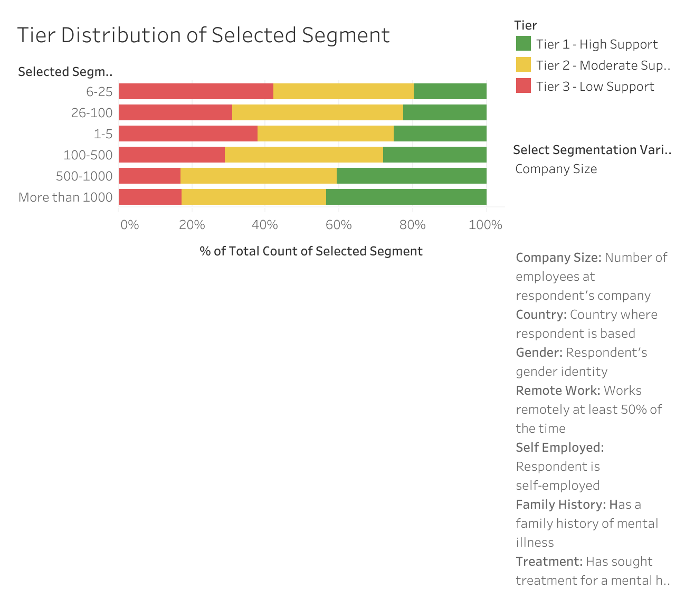
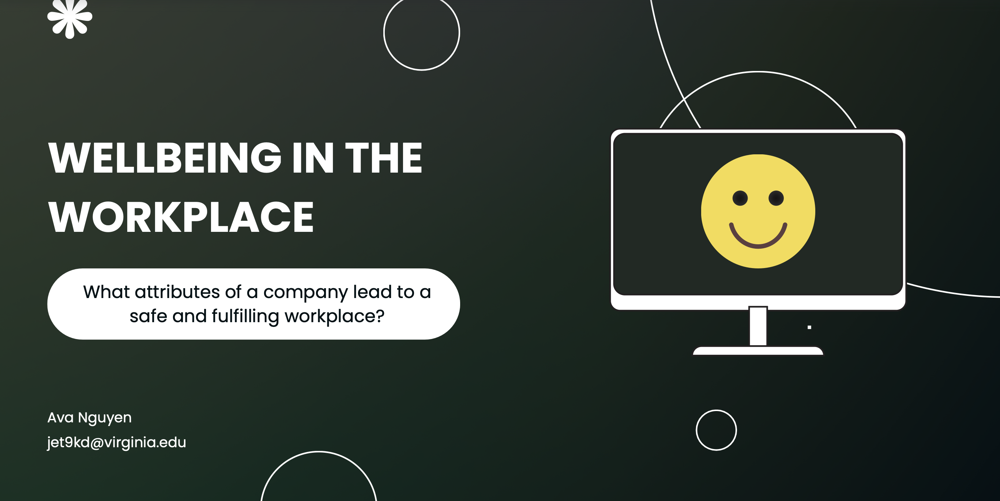

# Wellbeing in the Workplace Analysis

Analyzed 1,233 responses from a Mental Health in Tech survey to identify what predicts workplace support. Provided actionable recommendations for organizations with low/moderate support.

## Overview

- Question: How can a company increase wellbeing in the workplace?
- Dataset: Mental Health in Tech Survey

 The challenge was working with a subjective concept like wellbeing, where there was no set metric in the survey. 
 However, I decided to measure it by creating a custom scoring system. Then sorted into low, moderate, and high support based on scores.

 Once sorted, one was able to see where low, moderate, and high support was distributed amongst variables like gender, country, etc.

## Results
- [View interactive dashboard](https://public.tableau.com/shared/X57TCT4JP?:display_count=n&:origin=viz_share_link)

- [View slide deck (PDF)](slidedeck)

## Data

Dataset found on Kaggle: 
- https://www.kaggle.com/datasets/osmi/mental-health-in-tech-survey 

## Tools used

- Python (numpy, pandas, seaborn, matplotlib)
- Tableau
